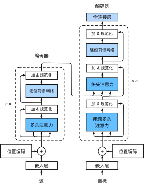

# SAC 算法分析

## 引言

在强化学习领域，如何平衡探索与利用一直是一个核心挑战。传统的强化学习算法往往需要精心设计探索策略，而 Soft Actor-Critic (SAC) 算法通过引入**最大熵框架**，将探索机制自然地融入到优化目标中，为这一难题提供了优雅的解决方案。SAC不仅在学习效率上表现出色，还在稳定性和收敛性方面具有显著优势，成为连续控制任务中的主流算法。

本文深入探讨 Soft Actor-Critic（SAC）算法，这是一种在连续控制任务中表现出色的深度强化学习算法。SAC巧妙地将最大熵原理融入传统强化学习框架，通过平衡探索与利用，实现了高效稳定的学习过程。我们将从基础理论出发，逐步推导SAC的核心公式，并详细解释其实现细节。

## 从传统 RL 到最大熵 RL

### 传统强化学习的局限

传统的强化学习算法致力于寻找最大化累积奖励的策略：

$$
J_{\text{standard}}(\pi) = \mathbb{E}_{\tau \sim \pi} \left[ \sum_{t=0}^\infty \gamma^t r(s_t, a_t) \right]
$$

其中 $ \tau = (s_0, a_0, s_1, a_1, \dots) $ 表示轨迹，$ \gamma \in [0,1) $ 是折扣因子。

然而，这种范式存在一个根本性挑战：**探索与利用的权衡**。它倾向于选择确定性策略，容易导致探索不足和过早收敛到次优解。传统的ε-greedy或添加噪声的方法往往缺乏理论基础，且效率有限。最大熵强化学习提供了一种优雅的解决方案：在奖励最大化的同时，最大化策略的熵。

### 最大熵强化学习框架

最大熵强化学习在奖励最大化的基础上，增加了策略熵最大化的目标：
$$
J(\pi) = \mathbb{E}_{\tau \sim \pi} \left[ \sum_{t=0}^\infty \gamma^t \left( r(s_t, a_t) + \alpha \mathcal{H}(\pi(\cdot|s_t)) \right) \right]
$$

其中：
- $ \alpha > 0 $ 是温度参数，控制熵项的重要性
- $ \mathcal{H}(\pi(\cdot|s_t)) = \mathbb{E}_{a \sim \pi(\cdot|s_t)} [-\log \pi(a|s_t)] $ 是策略在状态 $ s_t $ 下的熵

**策略熵的意义**：
1. **鼓励探索**：高熵策略在状态$s$下选择不同动作的概率更均匀
2. **鲁棒性**：面对环境不确定性时表现更稳健
3. **多模态学习**：能学习到多个可行的最优动作

### 温度参数的动态平衡

温度参数 $ \alpha $ 决定了探索与利用的权衡：
- `$\alpha \to 0$`：退化为传统强化学习，强调奖励最大化
- `$\alpha \to \infty$`：完全随机策略，强调探索最大化

**直观理解**：
- 当 $ \alpha $ 较小时：奖励的权重大，鼓励利用
- 当 $ \alpha $ 较大时：熵的权重大，鼓励探索

在实际应用中，$ \alpha $ 可以是固定的超参数，也可以通过自适应机制动态调整。

## 理论基础：Soft Policy Iteration

### Soft Q函数和Soft V函数

在最大熵框架下，我们重新定义价值函数。首先定义**Soft Q函数**：
$$
Q^{\pi}_{\text{soft}}(s, a) = r(s, a) + \gamma \mathbb{E}_{s' \sim p} \left[ V^{\pi}_{\text{soft}}(s') \right]
$$

其中**Soft V函数**定义为：
$$
V^{\pi}_{\text{soft}}(s) = \mathbb{E}_{a \sim \pi} \left[ Q^{\pi}_{\text{soft}}(s, a) - \alpha \log \pi(a|s) \right]
$$

这个定义体现了最大熵思想：状态价值不仅考虑期望回报，还考虑策略的随机性。

### Soft Policy Improvement Theorem

软策略改进定理保证了策略迭代的单调改进。给定策略$\pi$，我们可以构造改进后的策略$\pi'$：
$$
\pi' = \arg\min_{\pi} D_{\text{KL}} \left( \pi(\cdot|s) \Big\| \frac{\exp\left( \frac{1}{\alpha} Q^{\pi}_{\text{soft}}(s, \cdot) \right)}{Z^{\pi}_{\text{soft}}(s)} \right)
$$

其中：
- $D_{\text{KL}}$是KL散度，衡量两个分布的差异
- $Z^{\pi}_{\text{soft}}(s) = \int \exp\left( \frac{1}{\alpha} Q^{\pi}_{\text{soft}}(s, a) \right) da$ 是配分函数（归一化常数）

**推导过程**：

我们希望找到一个策略$\pi'$，使得对于所有状态$s$，都有$V^{\pi'}_{\text{soft}}(s) \geq V^{\pi}_{\text{soft}}(s)$。

令$Q^{\pi}_{\text{soft}}$是当前策略$\pi$的soft Q函数。定义新策略为：
$$
\pi'(\cdot|s) \propto \exp\left( \frac{1}{\alpha} Q^{\pi}_{\text{soft}}(s, \cdot) \right)
$$

可以证明：
$$
\begin{aligned}
V^{\pi}_{\text{soft}}(s) &= \mathbb{E}_{a \sim \pi} \left[ Q^{\pi}_{\text{soft}}(s, a) - \alpha \log \pi(a|s) \right] \\
&\leq \mathbb{E}_{a \sim \pi'} \left[ Q^{\pi}_{\text{soft}}(s, a) - \alpha \log \pi'(a|s) \right] \\
&= V^{\pi'}_{\text{soft}}(s)
\end{aligned}
$$

等号成立当且仅当$\pi = \pi'$。

### Soft Policy Evaluation

软策略评估通过固定策略$\pi$，迭代更新Q函数：
$$
\mathcal{T}^{\pi} Q(s, a) \triangleq r(s, a) + \gamma \mathbb{E}_{s' \sim p} \left[ \mathbb{E}_{a' \sim \pi} \left[ Q(s', a') - \alpha \log \pi(a'|s') \right] \right]
$$

这个Bellman备份算子$\mathcal{T}^{\pi}$是压缩映射，保证迭代收敛到唯一的固定点$Q^{\pi}_{\text{soft}}$。

## Soft Policy Iteration：理论推导

### Soft Value Functions

在最大熵框架下，我们重新定义价值函数：

**Soft Q-function**:
$$
Q(s_t, a_t) = r(s_t, a_t) + \gamma \mathbb{E}_{s_{t+1} \sim p} [V(s_{t+1})]
$$

**Soft V-function**:
$$
V(s_t) = \mathbb{E}_{a_t \sim \pi} [Q(s_t, a_t) - \alpha \log \pi(a_t|s_t)]
$$

将两者结合，得到**Soft Bellman Equation**：
$$
Q(s_t, a_t) = r(s_t, a_t) + \gamma \mathbb{E}_{s_{t+1} \sim p, a_{t+1} \sim \pi} [Q(s_{t+1}, a_{t+1}) - \alpha \log \pi(a_{t+1}|s_{t+1})]
$$

### 收敛性证明

**定理 3.1** (Soft Policy Evaluation Convergence): 对于任意策略 $ \pi $，重复应用Soft Bellman算子 $ T^\pi $：
$$
T^\pi Q(s,a) = r(s,a) + \gamma \mathbb{E}_{s' \sim p, a' \sim \pi} [Q(s',a') - \alpha \log \pi(a'|s')]
$$
会收敛到唯一的Soft Q函数 $ Q^\pi $。

**证明概要**:
1. Soft Bellman算子是γ-收缩映射
2. 根据Banach不动点定理，存在唯一不动点

**定理 3.2** (Soft Policy Improvement): 定义新策略：
$$
\pi_{\text{new}} = \arg\min_{\pi'} D_{\text{KL}} \left( \pi'(\cdot|s) \Big\| \frac{\exp(\frac{1}{\alpha} Q^{\pi_{\text{old}}}(s,\cdot))}{Z^{\pi_{\text{old}}}(s)} \right)
$$
其中 $ Z^{\pi_{\text{old}}}(s) = \int \exp(\frac{1}{\alpha} Q^{\pi_{\text{old}}}(s,a)) da $ 是配分函数。则对于所有 $ (s,a) $，有 $ Q^{\pi_{\text{new}}}(s,a) \geq Q^{\pi_{\text{old}}}(s,a) $。

## SAC算法详述

### 网络架构设计

SAC采用Actor-Critic架构，包含以下组件：

#### Q网络 (Double Q-Networks)
为防止Q值高估，SAC使用两个独立的Q网络：
$$
Q_{\theta_1}(s,a), \quad Q_{\theta_2}(s,a)
$$
取两者最小值作为目标：
$$
Q_{\min}(s,a) = \min(Q_{\theta_1}(s,a), Q_{\theta_2}(s,a))
$$

#### 策略网络 (Policy Network)
策略网络输出高斯分布的参数：
$$
\mu_\phi(s), \quad \sigma_\phi(s)
$$
使用重参数化技巧采样：
$$
a = \tanh(\mu_\phi(s) + \sigma_\phi(s) \odot \epsilon), \quad \epsilon \sim \mathcal{N}(0,I)
$$
动作概率密度为：
$$
\log \pi_\phi(a|s) = \log p(\mu,\sigma) - \sum_{i=1}^{d_a} \log(1 - \tanh^2(a_i))
$$
其中 $ p(\mu,\sigma) $ 是原始高斯分布的概率密度。

#### 目标网络 (Target Networks)
使用软更新策略：
$$
\bar{\theta}_i \leftarrow \tau \theta_i + (1-\tau)\bar{\theta}_i, \quad i=1,2
$$
其中 $ \tau \ll 1 $（通常为0.005）。

### 损失函数推导

#### Q函数损失
基于Soft Bellman方程，目标值计算为：
$$
y = r(s,a) + \gamma \left( \min_{j=1,2} Q_{\bar{\theta}_j}(s', a') - \alpha \log \pi_\phi(a'|s') \right)
$$
其中 $ a' \sim \pi_\phi(\cdot|s') $。

Q网络损失函数：
$$
\mathcal{L}_Q(\theta_i) = \mathbb{E}_{(s,a,r,s') \sim \mathcal{D}} \left[ \frac{1}{2} \left( Q_{\theta_i}(s,a) - y \right)^2 \right], \quad i=1,2
$$

**梯度计算**:
$$
\nabla_{\theta_i} \mathcal{L}_Q(\theta_i) = \mathbb{E}_{(s,a,r,s') \sim \mathcal{D}} \left[ \left( Q_{\theta_i}(s,a) - y \right) \nabla_{\theta_i} Q_{\theta_i}(s,a) \right]
$$

#### 策略损失
策略网络的目标是最大化期望回报和熵：
$$
\mathcal{L}_\pi(\phi) = \mathbb{E}_{s \sim \mathcal{D}, \epsilon \sim \mathcal{N}} \left[ \alpha \log \pi_\phi(f_\phi(\epsilon;s)|s) - \min_{j=1,2} Q_{\theta_j}(s, f_\phi(\epsilon;s)) \right]
$$
其中 $ f_\phi(\epsilon;s) = \tanh(\mu_\phi(s) + \sigma_\phi(s) \odot \epsilon) $。

使用重参数化梯度：
$$
\nabla_\phi \mathcal{L}_\pi(\phi) = \mathbb{E}_{s \sim \mathcal{D}, \epsilon \sim \mathcal{N}} \left[ \nabla_\phi \left( \alpha \log \pi_\phi(a|s) - Q_{\min}(s,a) \right) \right]
$$
其中 $ a = f_\phi(\epsilon;s) $。

#### 温度参数自适应
SAC可以自动调整温度参数 $ \alpha $ 以维持目标熵 $ \bar{\mathcal{H}} $。目标熵通常设为：
$$
\bar{\mathcal{H}} = -\dim(\mathcal{A})
$$
即动作维度的负数。

温度参数的损失函数：
$$
\mathcal{L}(\alpha) = \mathbb{E}_{s \sim \mathcal{D}, a \sim \pi_\phi} \left[ -\alpha \left( \log \pi_\phi(a|s) + \bar{\mathcal{H}} \right) \right]
$$

**梯度更新**:
$$
\nabla_\alpha \mathcal{L}(\alpha) = \mathbb{E}_{s \sim \mathcal{D}, a \sim \pi_\phi} \left[ -\left( \log \pi_\phi(a|s) + \bar{\mathcal{H}} \right) \right]
$$

## SAC算法详解

### 网络架构

SAC使用五个神经网络：

1. **策略网络（Actor）**：$\pi_\phi(a|s)$
2. **两个Q网络（Critic）**：$Q_{\theta_1}(s, a)$，$Q_{\theta_2}(s, a)$
3. **两个目标Q网络**：$Q_{\bar{\theta}_1}(s, a)$，$Q_{\bar{\theta}_2}(s, a)$

#### 策略网络设计

对于连续动作空间，策略网络通常输出高斯分布的参数：
$$
a = \tanh(\mu_\phi(s) + \sigma_\phi(s) \odot \epsilon), \quad \epsilon \sim \mathcal{N}(0, I)
$$

对数概率的计算需要考虑tanh变换的雅可比行列式：
$$
\log \pi_\phi(a|s) = \log p(u|s) - \sum_{i=1}^{d_a} \log(1 - \tanh^2(u_i) + \epsilon)
$$

其中$u = \mu_\phi(s) + \sigma_\phi(s) \odot \epsilon$，$\epsilon$是为了数值稳定性添加的小常数。

#### Q网络设计

Q网络接收状态和动作的拼接作为输入，输出标量Q值：
$$
Q_{\theta}(s, a) = f_{\theta}(\text{concat}(s, a))
$$

其中$f_{\theta}$可以是多层感知机。

### 损失函数推导

#### Q函数损失

SAC使用两个独立的Q网络来减少价值过估计。Q网络的训练目标是最小化Bellman残差：
$$
\mathcal{L}_Q(\theta_i) = \mathbb{E}_{(s,a,r,s',d) \sim \mathcal{D}} \left[ \left( Q_{\theta_i}(s, a) - y(r, s', d) \right)^2 \right], \quad i=1,2
$$

其中目标值$y$计算为：
$$
y(r, s', d) = r + \gamma(1-d) \left( \min_{j=1,2} Q_{\bar{\theta}_j}(s', \tilde{a}') - \alpha \log \pi_\phi(\tilde{a}'|s') \right)
$$

这里：
- $\tilde{a}' \sim \pi_\phi(\cdot|s')$ 是从当前策略采样的动作
- $d$ 是终止标志（episode是否结束）
- $\min$操作减少了价值过估计
- $\bar{\theta}_j$ 是目标网络参数，通过Polyak平均更新

**目标网络更新**：
$$
\bar{\theta}_i \leftarrow \tau \theta_i + (1-\tau) \bar{\theta}_i, \quad i=1,2
$$

其中$\tau \ll 1$（通常为0.005），确保目标值变化缓慢，提高训练稳定性。

#### 策略网络损失

策略网络的优化目标是最大化期望回报与熵的加权和：
$$
\mathcal{L}_\pi(\phi) = \mathbb{E}_{s \sim \mathcal{D}} \left[ \alpha \log \pi_\phi(\tilde{a}|s) - \min_{j=1,2} Q_{\theta_j}(s, \tilde{a}) \right]
$$

其中$\tilde{a} = f_\phi(s, \epsilon)$通过重参数化技巧生成。

**重参数化技巧**：
为了避免采样操作阻断梯度传播，我们使用：
$$
\tilde{a} = \tanh(\mu_\phi(s) + \sigma_\phi(s) \odot \epsilon), \quad \epsilon \sim \mathcal{N}(0, I)
$$

这样梯度可以通过$\mu_\phi(s)$和$\sigma_\phi(s)$反向传播。

#### 温度参数自适应

温度参数$\alpha$控制探索与利用的平衡。我们可以通过最小化以下损失来自动调整$\alpha$：
$$
\mathcal{L}(\alpha) = \mathbb{E}_{s \sim \mathcal{D}, a \sim \pi_\phi} \left[ -\alpha \left( \log \pi_\phi(a|s) + \bar{\mathcal{H}} \right) \right]
$$

其中$\bar{\mathcal{H}}$是目标熵，通常设为$-\dim(\mathcal{A})$。

**推导**：
我们希望策略的熵接近目标熵$\bar{\mathcal{H}}$，因此最小化：
$$
\mathbb{E}_{s \sim \mathcal{D}} \left[ \mathcal{H}(\pi(\cdot|s)) - \bar{\mathcal{H}} \right]
$$

由于$\mathcal{H}(\pi(\cdot|s)) = -\mathbb{E}_{a \sim \pi}[\log\pi(a|s)]$，我们得到上述损失函数。

### 完整算法流程

#### 算法：Soft Actor-Critic (SAC)

**输入**：
- 环境$\mathcal{E}$
- 初始策略参数$\phi$，Q网络参数$\theta_1, \theta_2$
- 目标网络参数$\bar{\theta}_1 \leftarrow \theta_1, \bar{\theta}_2 \leftarrow \theta_2$
- 经验回放缓冲区$\mathcal{D}$
- 目标熵$\bar{\mathcal{H}}$
- 学习率$\lambda_\pi, \lambda_Q, \lambda_\alpha$
- 折扣因子$\gamma$，软更新系数$\tau$

**初始化**：
1. 初始化所有网络参数
2. 清空经验回放缓冲区

**循环**（对于每个时间步$t=1,2,\ldots$）：
1. **观察状态**：$s_t \leftarrow \text{环境状态}$
2. **选择动作**：$a_t \sim \pi_\phi(\cdot|s_t)$
3. **执行动作**：$s_{t+1} \sim p(\cdot|s_t, a_t), r_t = r(s_t, a_t)$
4. **存储经验**：$\mathcal{D} \leftarrow \mathcal{D} \cup \{(s_t, a_t, r_t, s_{t+1}, d_t)\}$
5. **如果训练条件满足**：
   - 从$\mathcal{D}$中采样批次$\mathcal{B} = \{(s, a, r, s', d)\}$
   - 计算目标值：
     $$
     y = r + \gamma(1-d) \left( \min_{j=1,2} Q_{\bar{\theta}_j}(s', \tilde{a}') - \alpha \log \pi_\phi(\tilde{a}'|s') \right)
     $$
     其中$\tilde{a}' \sim \pi_\phi(\cdot|s')$
   - 更新Q网络：
     $$
     \theta_i \leftarrow \theta_i - \lambda_Q \nabla_{\theta_i} \frac{1}{|\mathcal{B}|} \sum_{(s,a,r,s',d) \in \mathcal{B}} \left( Q_{\theta_i}(s, a) - y \right)^2, \quad i=1,2
     $$
   - 更新策略网络：
     $$
     \phi \leftarrow \phi - \lambda_\pi \nabla_\phi \frac{1}{|\mathcal{B}|} \sum_{s \in \mathcal{B}} \left( \alpha \log \pi_\phi(\tilde{a}|s) - \min_{j=1,2} Q_{\theta_j}(s, \tilde{a}) \right)
     $$
   - 更新温度参数（如果自适应）：
     $$
     \alpha \leftarrow \alpha - \lambda_\alpha \nabla_\alpha \frac{1}{|\mathcal{B}|} \sum_{s \in \mathcal{B}} \left( -\alpha (\log \pi_\phi(\tilde{a}|s) + \bar{\mathcal{H}}) \right)
     $$
   - 更新目标网络：
     $$
     \bar{\theta}_i \leftarrow \tau \theta_i + (1-\tau) \bar{\theta}_i, \quad i=1,2
     $$

## 关键实现细节

### 重参数化技巧的数学推导

对于高斯策略 $ \pi(a|s) = \mathcal{N}(\mu(s), \sigma^2(s)) $，直接采样 $ a \sim \mathcal{N}(\mu, \sigma^2) $ 不可微分。重参数化技巧将其改写为：
$$
a = \mu(s) + \sigma(s) \odot \epsilon, \quad \epsilon \sim \mathcal{N}(0, I)
$$
这样梯度可以通过 $ \mu $ 和 $ \sigma $ 传播：
$$
\nabla_\phi a = \nabla_\phi \mu(s) + \nabla_\phi \sigma(s) \odot \epsilon
$$

### Tanh变换的概率修正

当使用tanh激活函数时，动作的概率密度需要修正：
$$
\log \pi(a|s) = \log p(\mu,\sigma) - \sum_{i=1}^{d_a} \log(1 - \tanh^2(a_i)) + \text{常数}
$$
这个修正项来自变量变换公式：
$$
p_y(y) = p_x(x) \left| \frac{dx}{dy} \right|
$$
其中 $ y = \tanh(x) $，所以 $ \frac{dx}{dy} = \frac{1}{1-y^2} $。

### 梯度计算中的Stop-Gradient操作

在实现中，需要注意某些梯度应该被阻断：
1. 计算Q目标时，$ \pi_\phi $ 的参数梯度不应传播
<!-- 2. 计算策略损失时，Q网络的参数梯度不应传播 -->

### 经验回放设计

SAC是off-policy算法，需要经验回放缓冲区。最佳实践包括：
1. **缓冲区大小**：通常$10^6$个转移
2. **优先经验回放**：可根据TD误差设置优先级，但不是必需的
3. **批次大小**：256-512，较大批次可以提高训练稳定性

### 网络初始化

1. **最终层初始化**：
   - Q网络最后一层权重初始化为$[-3\times10^{-3}, 3\times10^{-3}]$
   - 策略网络输出层：
     - $\mu$层权重初始化为$[-3\times10^{-3}, 3\times10^{-3}]$
     - $\log\sigma$层初始化为较小值（如-0.5）
2. **激活函数**：ReLU或Swish效果较好

### 训练策略

1. **预热阶段**：在开始训练前，收集一定数量的随机经验
2. **延迟策略更新**：每更新Q网络$n$次，更新一次策略网络（通常$n=1$或$2$）
3. **梯度裁剪**：防止梯度爆炸

### 超参数调优

| 参数 | 推荐值 | 说明 |
|------|--------|------|
| $ \gamma $ | 0.99 | 标准折扣因子 |
| $ \tau $ | 0.005 | 目标网络更新率 |
| $ \lambda_\pi, \lambda_Q $ | $ 3\times10^{-4} $ | Adam学习率 |
| 批次大小 | 256 | 经验回放采样 |
| 缓冲区大小 | $ 10^6 $ | 经验回放容量 |
| 隐藏层维度 | 256 | 网络宽度 |
| 隐藏层数 | 2 | 网络深度 |
| 目标熵$ \bar{\mathcal{H}} $ | $ -\dim(\mathcal{A}) $ | 自动调整温度的目标 |

| 参数 | 推荐值 | 说明 |
|------|--------|------|
| 学习率$ η_Q $ | 3e-4 | Q网络学习率 |
| 学习率$ η_π $ | 3e-4 | 策略网络学习率 |
| 学习率$ η_α $ | 3e-4 | 温度参数学习率 |
| 折扣因子$ γ $ | 0.99 | 长期奖励折扣 |
| 软更新系数$ τ $ | 0.005 | 目标网络更新速度 |
| 批次大小 | 256 | 训练批次大小 |
| 缓冲区大小 | 1e6 | 经验回放容量 |
| 初始温度$ α $ | 0.2 | 温度参数初始值 |
| 目标熵$ ℋ̄ $ | -dim(𝒜) | 自动调整的目标 |

### 网络架构设计建议

1. **隐藏层大小**：通常使用2-3层，每层256-512个神经元
2. **激活函数**：ReLU或Swish
3. **初始化**：使用正交初始化
4. **归一化**：状态归一化可以显著改善性能

## 理论分析与性能保证

### 收敛性分析

**定理 9.1** (SAC收敛性): 在适当的学习率下，SAC算法收敛到最优最大熵策略 $ \pi^*\ $。

**证明思路**:
1. Soft Policy Iteration收敛到唯一最优解
2. 函数近似误差有界
3. 经验回放和软更新保证稳定性

### 样本效率分析

SAC是Off-Policy算法，样本效率显著高于On-Policy方法：
- 经验复用：每个样本可以使用多次
- 批量学习：从历史数据中学习
- 稳定训练：目标网络减少目标值波动

### 探索效率分析

最大熵框架下的探索效率：
- 策略熵衡量探索程度
- 温度参数 $ \alpha $ 自适应调整探索强度
- 高斯噪声实现连续探索

## 结论

Soft Actor-Critic算法通过最大熵框架优雅地解决了连续控制中的探索-利用权衡问题。其理论完备性、实现简洁性和卓越性能使其成为当前强化学习领域的重要里程碑。Soft Actor-Critic算法通过最大熵框架，巧妙地将探索机制融入到强化学习目标中，实现了探索与利用的自然平衡。其核心优势在于：

1. **理论优雅**：基于最大熵原理，有坚实的理论基础
2. **实践高效**：结合了Q-learning的样本效率和策略梯度的灵活性
3. **鲁棒性强**：对超参数相对不敏感，易于部署

> - SAC算法在多个连续控制基准任务上表现出色，展示了深度强化学习在复杂连续控制任务中的巨大潜力，为智能体在不确定环境中的自主决策提供了强大工具。由于off-policy特性，SAC的样本效率通常优于on-policy算法（如PPO）。
> - 最大熵强化学习框架赋予SAC强大的探索能力，为处理探索-利用困境、提高学习稳定性和样本效率提供了新的视角，在需要复杂探索策略的任务中表现优异，是强化学习领域的重要发展方向。
> - 对于研究者和实践者而言，深入理解SAC不仅有助于应用这一算法，更能提供设计新算法的思路和灵感。随着研究的深入，SAC的变体和改进不断涌现，进一步扩展了其应用范围。

