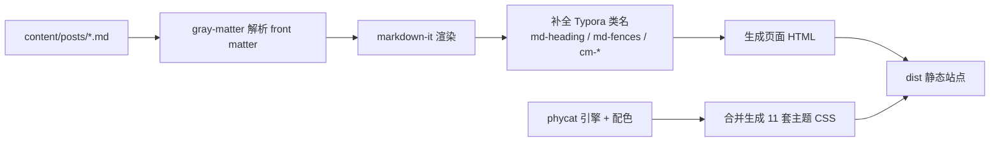

## 总体思路

Phycat 的样式引擎是为 **Typora 导出的 HTML 结构** 编写的，而 Typora 本身基于 markdown-it。因此本站采用「**markdown-it 渲染 + 复刻 Typora 类名 + 直接加载 Phycat CSS**」的方案，实现与 Typora 导出几乎一致的渲染效果。

## 构建流程



## 关键技术点

| 模块 | 技术 | 说明 |
| ---- | ---- | ---- |
| 渲染 | markdown-it | 与 Typora 同源，DOM 结构最接近 |
| 高亮 | highlight.js → cm-* | 把 token 映射成 Typora 的 CodeMirror 类名 |
| 主题 | CSS 变量合并 | 引擎 + 配色文件合并成单文件 |
| 构建 | Node 脚本 | 零框架，输出纯静态 HTML |

> [!IMPORTANT]
> 想让渲染效果与 Typora 一致，关键是让 markdown-it 输出 Typora 的 DOM 类名（如 `pre.md-fences`、`h3.md-heading`），而不是重写 Phycat 的 CSS。

## 主题切换原理

Phycat 的配色全部通过 CSS 变量定义（如 `--element-color`、`--bg-color`）。主题 CSS 就是「引擎规则 + 一组变量」：

```css
/* 引擎规则（约 2000 行）全部引用变量 */
#write h2 { background: var(--head-title-h2-background); }

/* 配色文件只覆盖变量 */
:root {
  --head-title-color: #11aa63;
  --element-color: #11aa63;
}
```

前端切换主题 = 切换 `<link>` 的 `href`，并记住选择，刷新不丢失。

## 数据流小结

1. 在 `content/posts/` 添加或修改 `.md` 文件
2. 运行 `npm run build`
3. 把 `dist/` 部署到任意静态托管